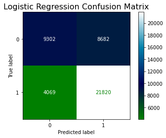
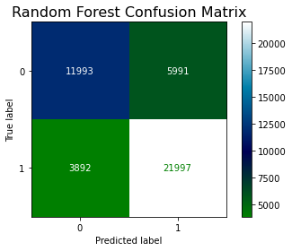
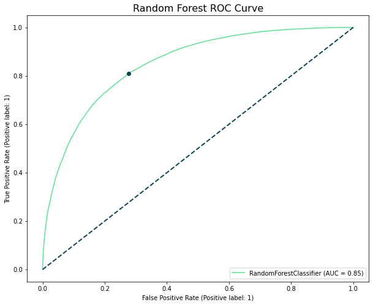
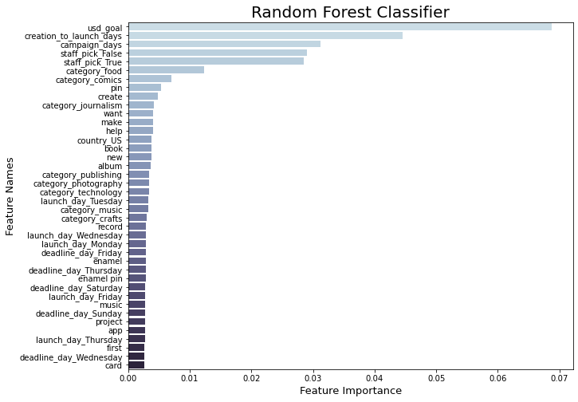

# Kickstarter Campaigns

## Background

I really enjoy and admire the spirit and the grit of entrepreneurial endeavors. Surrounded by friends and family who live lives as entrepreneurs, I often feel very invested in their journey as well as their triumphs and challenges along the way. One of my favorite podcasts has to be Guy Raz’s ‘How I Built This’, whose interviews I find engaging and entertaining.

## Data

Kickstarter data consisted of 213,000 campaigns and 37 features (source: [https://webrobots.io/](https://webrobots.io/)). It includes various campaign details in the form of dates, amounts, categories, photos,  text, etc. See the figure below for some preliminary highlights: 

## Baseline Models

#### Logistic Regression 

With its quickness to train and predict and interpretability, this presented as a place to start.

Logistic regression performed reasonably with a 71.0% accuracy and 71% f1-score. 

#### Gradient Boosting Classifier

Interested in ensemble modeling, gradient boosting presents as one with tremendous predictive power, but also little interpretability and a challenge to tune.

The gradient boosting classifier performed with a 74.4% accuracy and 74% f1-score. 

#### Random Forest Classifier

Interested in ensemble modeling, random forest also presents as a contender sharing qualities with gradient boosting; albeit with some variation as certain tradeoffs take place.

The random forest classifier fell a little short in comparison to the gradient boosting classifier with a 72.2% accuracy and 72% f1-score.

## Results

With the addition of NLP features from the 'blurb' feature, we see model improvement and significant feature importances derived from words extracted the blurbs. See evaluation of the random forest classifier below:

## Future Analysis

With high dimensionality added up between all the features, particularly the categorical and text features, PCA or other dimensionality reduction techniques would be useful in capturing variance in a model while minimizing the number of components.

I'm also highly interested in applying convolutional neural networks to campaign photos. The original dataset contains the URLs to the photos. Given the nature and objective of crowdfunding, these photos hold a strong position as a feature.

## Acknowledgements

Thanks to Juliana Duncan, Dan Rupp & Kiara Hearn for their help and guidance during this project.

## References
Dataset: [https://webrobots.io/](https://webrobots.io/)
