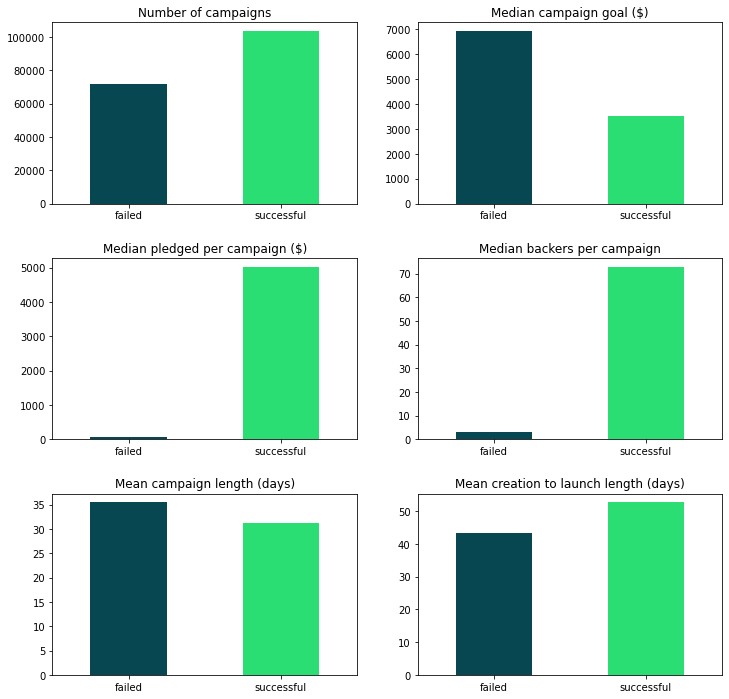

*

# Kickstarter Campaigns

### Background

I really enjoy and admire the spirit and the grit of entrepreneurial endeavors. Constantly surrounding myself with friends and family who live lives as entrepreneurs, I often feel very invested in their journey as well as their triumphs and challenges along the way. One of my favorite podcasts has to be Guy Raz’s ‘How I Built This’, whose interviews I find engaging and entertaining.

### Question

### Data

Kickstarter data consisted of 213,000 campaigns and 37 features (source: [https://webrobots.io/](https://webrobots.io/)). It includes various campaign details in the form of dates, amounts, categories, photos,  text, etc. See the figure below for preliminary highlights: 

### Model

The statistical test applied is a Welch’s t-test on the difference of means between the winning and losing team samples (without knowing the standard deviations of the winning and losing team populations, the student’s t-test is not well suited here). Because the sample sizes are sufficiently large, we can additionally consider that the central limit theorem applies and therefore we can reasonably assert that the distribution for the difference of means approximates the normal distribution.

### Results

For each of the play statistics below, the null hypothesis is rejected - there is statistical evidence to infer that both offensive and defensive game play stats play into wins.

With a significance level selected at 5% and a conservative Bonferroni correction application which further sets the significance level at 1% for each t-test, the Welch’s t-tests results of infinitesimally small p-values provide suitable statistical evidence. 

p-value: 3.029870529831025e-129

p-value: 3.04422770092005e-12

p-value: 1.4689448438961602e-07

p-value: 7.22946836638982e-07

p-value: 2.969990853938123e-1

### Future Analysis

With more recently available NBA stats published on opponent's shooting, exploring other robust measures of defensive play such as a block attempts rate (BLKA rate), a ratio of block attempts to an opponent's field goal attempts, would add to create a more full picture of the analysis.

A redesign of the statistical tests could for instance look at the top and bottom 10 teams across a number of NBA seasons to compare pairs of stats for statistical significance such as OREB% and DREB%, FGA and BLKA rates, etc.

### Acknowledgements

Thanks to Juliana Duncan, Dan Rupp & Kiara Hearn for their help and guidance during this project.

### References
API client package: [nba-api](https://pypi.org/project/nba-api/)
